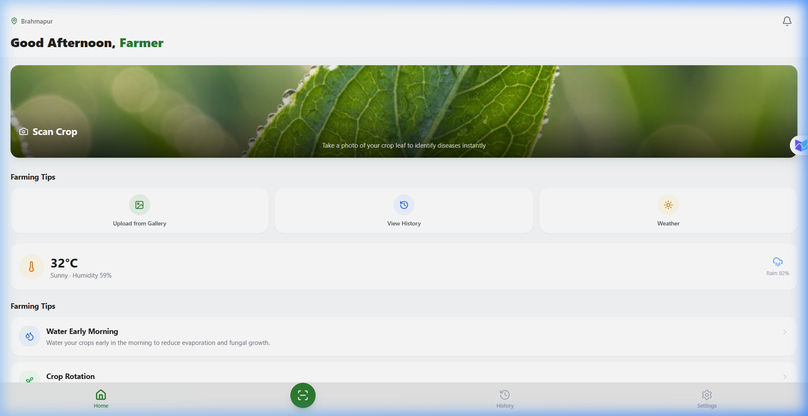
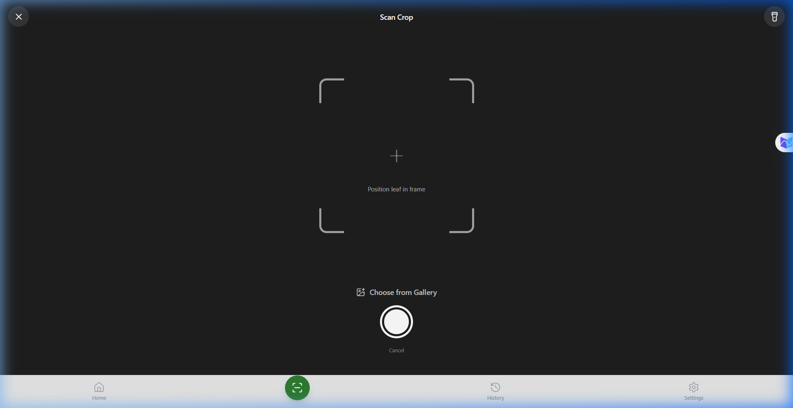
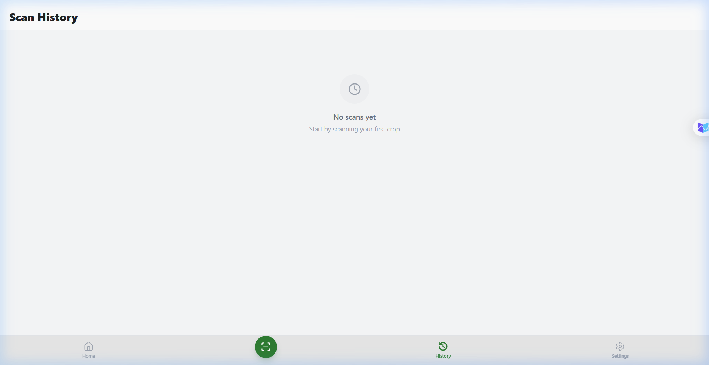
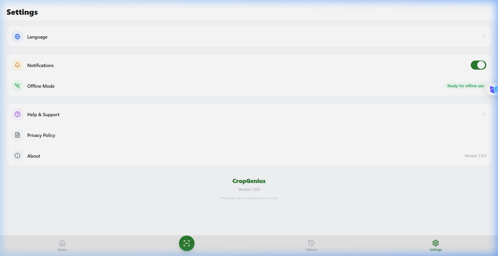
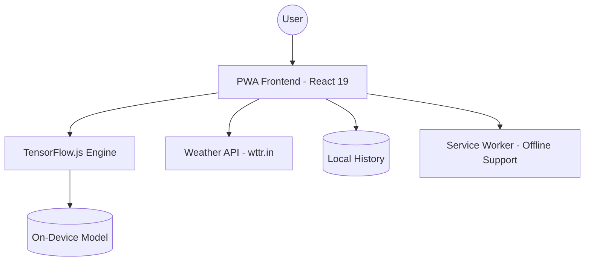
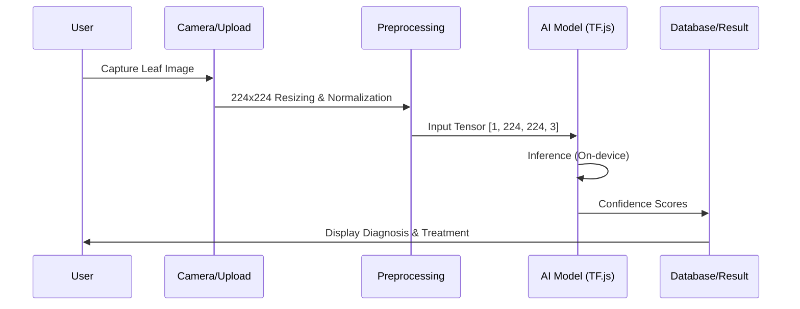

# 🌿 CropGenius: AI-Powered Crop Doctor



**CropGenius** is a state-of-the-art Progressive Web Application (PWA) designed to help farmers identify crop diseases instantly using AI. By leveraging **TensorFlow.js** for on-device inference, the app works even in areas with poor internet connectivity, providing critical diagnostic support directly in the field.


---

## 🚀 Key Features

*   **Real-time AI Diagnosis**: Detects 38 different disease classes across 10+ crop types (Tomato, Potato, Corn, Apple, etc.).
*   **Offline First**: Powered by TensorFlow.js, the AI model runs locally on your device—no internet required for scanning.
*   **Live Weather Monitoring**: Real-time temperature, humidity, and rain alerts via `wttr.in` API integration.
*   **Treatment Roadmap**: Provides detailed Organic, Chemical, and Prevention strategies for every detected disease.
*   **Multilingual Support**: Fully localized in English, Hindi, and several regional languages.
*   **Premium UX**: A "Mobile-First" glassmorphic design built with Tailwind CSS and smooth Framer-like animations.

---

## 📱 App Screenshots

| Home | Scan | History | Settings |
|------|------|---------|----------|
|  |  |  |  |

---


## 🏗️ Technical Architecture

### 1. System Overview


### 2. The AI Engine (The Brain)

*   **Model Type**: Convolutional Neural Network (CNN) optimized for mobile vision.
*   **Dataset**: Trained on the **PlantVillage Dataset** (54,303 images of healthy and diseased plant leaves).
*   **Format**: Converted from Keras (`.h5`) to TensorFlow.js Layers Model for browser execution.
*   **Inference Process**:
    1.  **Capture**: Image is taken via the browser's `navigator.mediaDevices`.
    2.  **Preprocessing**: Image is resized to **224x224 pixels** and normalized (pixel values scaled 0 to 1).
    3.  **Tensors**: Converted to a 4D Tensor `[1, 224, 224, 3]`.
    4.  **Prediction**: The model outputs a probability array of 38 classes.
    5.  **Post-processing**: The top-confidence class is mapped to our disease database.

### 3. System Flow


### 4. The Frontend Stack

*   **Framework**: React 19 + Vite (for ultra-fast builds).
*   **Type Safety**: TypeScript for robust, error-free development.
*   **Styling**: Tailwind CSS for a modern, responsive UI.
*   **State Management**: React Context API with custom hooks (`useApp`) for global app state.

### 3. Security & Optimization
*   **Content Security Policy (CSP)**: Hardened headers to prevent XSS and unauthorized data injection.
*   **PWA**: Service Worker integration for offline asset caching.
*   **Performance**: Sharded model weights (4MB chunks) for faster parallel loading.

---

## 📂 Project Structure

```text
src/
├── components/     # Reusable UI components
├── data/           # Disease database & Language translations
├── hooks/          # Custom hooks (useApp, useAppContext)
├── screens/        # Main application views (Home, Scan, Result)
├── types/          # TypeScript interfaces
└── main.tsx        # App entry point

public/
└── model/          # TensorFlow.js model files (.json + shards)
```

---

## 🛠️ Setup & Installation

1. **Clone the project**:
   ```bash
   git clone <your-repo-url>
   ```

2. **Install dependencies**:
   ```bash
   npm install
   ```

3. **Run in development**:
   ```bash
   npm run dev
   ```

4. **Build for production**:
   ```bash
   npm run build
   ```

---

## 📝 License
This project is for educational purposes. The model was trained using the PlantVillage dataset. 

**Developed with ❤️ for the future of Smart Agriculture.**
